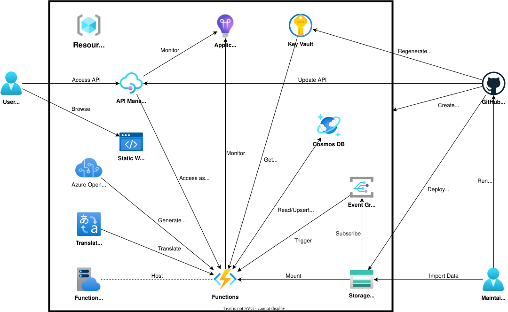

# 技術スタック

## 1. 要件と概要

### 1.1 要件

生成 AI を活用した、英語の IT 資格試験問題の学習支援システムを提供する。

### 1.2 ソリューション概要

GitHub Pages を通して React + TailwindCSS をベースとし、レスポンシブデザインとアクセシビリティに配慮したシングルページアプリケーション(SPA)の静的サイトホスティングを行い、Azure OpenAI・Azure Translator を活用した多言語対応の学習プラットフォームを構築すべく、Azure Cosmos DB で学習データと進捗を管理することで、Azure API Management を通じて Azure Functions をベースとしたセキュア・スケーラブル・高可用性な API サーバーと連携することで、モダンな学習支援型 Web アプリケーションを提供する。

### 1.3 フロントエンド構成概要

システム全体の処理フローは以下の通りである:

1. ユーザーがインポートデータファイルを Azure Blob Storage にアップロードし、Azure Event Grid 経由の Blob トリガーの関数アプリが Azure Cosmos DB にテスト・問題のデータをインポートする。
2. ユーザーが Entra ID 認証でアプリケーションにログインし、MSAL によりアクセストークンを取得する。
3. フロントエンドアプリケーションが API Management 経由で関数アプリにアクセスし、Azure Cosmos DB で管理するテスト・問題・選択肢・学習履歴・お気に入り情報を取得・表示する。
4. 関数アプリが Azure Translator で翻訳を実行し、英語の問題文・選択肢を日本語で表示する。
5. ユーザーが問題を解答し、Azure OpenAI が正解の選択肢と各選択肢の正解/不正解理由を生成・表示しつつ、Azure Storage Queue トリガーの関数アプリが Azure Cosmos DB に非同期で保存する。
6. Azure OpenAI がコミュニティのディスカッションの内容要約を生成・表示しつつ、Azure Storage Queue トリガーの関数アプリが Azure Cosmos DB に非同期で保存する。
7. 学習進捗機能により、学習履歴・お気に入り情報を Azure Cosmos DB に保存する。

## 2. アーキテクチャ

### 2.1 使用技術・サービス

本システムでは、以下の技術スタックを利用して、スケーラブルかつ耐障害性の高いアーキテクチャーを構築する:

- フロントエンド
  - Node.js v24 (JavaScript ランタイム)
  - TypeScript (静的型付け JavaScript)
  - React (JavaScript UI ライブラリ)
  - React Router (クライアントサイドルーティング)
  - Vite (ビルドツール・開発サーバー)
  - Tailwind CSS (ユーティリティファースト CSS フレームワーク)
  - daisyUI (Tailwind CSS 向け UI コンポーネントライブラリ)
  - Lucide React (アイコンライブラリ)
  - Jotai (アトミックな状態管理)
  - Axios (HTTP クライアント)
  - Microsoft Authentication Library (MSAL) (Entra ID 認証)
  - ESLint (コード静的解析・品質管理)
  - Prettier (コードフォーマッタ)
  - GitHub (コードリポジトリ、CI/CD パイプライン管理)
  - GitHub Pages (静的サイトホスティング)
- バックエンド
  - Azure API Management (API バージョン管理・認証・ルーティング)
  - Azure Functions (サーバーレスアプリケーションロジック)
  - Azure Storage Account
    - Blob Storage (インポートデータファイル格納)
    - Queue Storage (非同期処理メッセージキュー)
  - Azure Event Grid（Blob Storageから Functions の Blob 拡張 Webhook へのイベント配信）
  - Azure Cosmos DB (NoSQL データベース・学習データ管理)
  - Azure Key Vault (シークレット・API キー管理)
  - Azure Application Insights (ログ記録・モニタリング)
  - Azure OpenAI (AI モデル・正解解説生成・ディスカッション要約)
  - Azure Translator (翻訳サービス)
  - GitHub (コードリポジトリ、CI/CD パイプライン管理)
  - Microsoft ID Platform (Entra ID 認証・アクセストークン発行)

### 2.2 ページ構成・ルーティング

本フロントエンドは、以下のページ構成で設計されている:

| ルート                                     | ページコンポーネント | 説明                         |
| ------------------------------------------ | -------------------- | ---------------------------- |
| `/`                                        | `RootPage`           | テスト一覧表示(トップページ) |
| `/tests/:testId/ready`                     | `TestReadyPage`      | テスト開始前の準備画面       |
| `/tests/:testId/questions/:questionNumber` | `TestQuestionPage`   | 問題解答画面                 |
| `/tests/:testId/result`                    | `TestResultPage`     | テスト結果表示画面           |
| `*`                                        | `NotFoundPage`       | 404 エラーページ             |

### 2.3 Azure リソース構成

以下の表は、本システムで使用する主要な Azure リソースとその役割を示している:

| Azure リソース名           | Azure サービス             | 概要                                                     | リージョン     |
| -------------------------- | -------------------------- | -------------------------------------------------------- | -------------- |
| (ユーザー指定)             | Azure API Management       | ユーザーからアクセスする API Management                  | japaneast      |
| (ユーザー指定)             | Azure Functions            | API Management からアクセスする Functions                | japaneast      |
| `qgtranslator-je-funcplan` | Azure App Service Plan     | Functions のプラン                                       | japaneast      |
| (ユーザー指定)             | Azure Storage Account      | Functions から参照するストレージアカウント               | japaneast      |
| (ユーザー指定)             | Azure Event Grid           | `import-items` の Blob 作成イベントを Functions に配信   | japaneast      |
| (ユーザー指定)             | Azure Cosmos DB            | Functions からアクセスする Cosmos DB                     | japaneast      |
| (ユーザー指定)             | Azure Key Vault            | シークレットを管理する Key Vault                         | japaneast      |
| `qgtranslator-je-insights` | Azure Application Insights | API Management/Functions を監視する Application Insights | japaneast      |
| (ユーザー指定)             | Azure OpenAI               | Functions からアクセスする Azure OpenAI                  | (ユーザー指定) |
| (ユーザー指定)             | Azure Translator           | Functions からアクセスする Translator                    | japaneast      |

> [!WARNING]  
> Azure OpenAI は、以下をすべてサポートする場所・モデル名・モデルバージョン・API バージョンを使用する必要がある。
>
> - [Structured outputs](https://learn.microsoft.com/ja-jp/azure/ai-services/openai/how-to/structured-outputs)
> - [Vision-enabled](https://learn.microsoft.com/ja-jp/azure/ai-services/openai/how-to/gpt-with-vision)

### 2.4 Azure アーキテクチャー図

以下の図は、システム全体のアーキテクチャを示している:



## 3. コア機能の実装詳細

### 3.1 インポートデータファイルによるテスト・問題データのインポート機能

Azure Cosmos DB に格納するデータは、**インポートデータファイル**とよばれる json ファイル`data/(コース名)/(テスト名).json`として管理する:
インポートデータファイルの json フォーマットを以下に示す。

```json
[
  {
    "subjects": ["問題文1", "https://www.example.com/aaa/xxx.png", "問題文2", ... ],
    "choices": ["選択肢1", "選択肢2", ... ],
    "answerNum": 1,
    "indicateSubjectImgIdxes": [0, ... ],
    "indicateChoiceImgs": [null, "https://www.example.com/bbb/yyy.png", ... ],
    "escapeTranslatedIdxes": {
      "subjects": [0, ... ],
      "choices": [1, ... ],
    },
    "discussions": [
      {
        "comment": "コメント1",
        "upvotedNum": 2,
        "selectedAnswer": "A"
      },
      {
        "comment": "コメント2",
        :
      },
      :
    ]
  },
  {
    "subjects": [ ... ],
    :
  },
]
```

json の各キーの説明を、以下に示す。

| キー名                    | 説明                                         | 必須指定 |
| ------------------------- | -------------------------------------------- | :------: |
| `subjects`                | 問題文/画像 URL                              |    o     |
| `choices`                 | 選択肢                                       |    o     |
| `answerNum`               | 回答の選択肢の個数                           |    o     |
| `indicateSubjectImgIdxes` | `subjects`で指定した画像 URL のインデックス  |          |
| `indicateChoiceImgs`      | `choices`の文章の後に続ける画像 URL          |          |
| `escapeTranslatedIdxes`   | 翻訳不要な`subjects`/`choices`のインデックス |          |
| `discussions`             | コミュニティでのディスカッション             |          |

`discussions`キーで配列で設定する連想配列の各キーの説明を、以下に示す。

| キー名           | 説明                     | 必須指定 |
| ---------------- | ------------------------ | :------: |
| `comment`        | ユーザーのコメント       |    o     |
| `upvotedNum`     | 賛成票数                 |    o     |
| `selectedAnswer` | ユーザーが選択した選択肢 |          |

インポートデータファイルに記載したテスト・問題のデータは、Azure 環境では Blob Storage に`import-items/{courseName}/{testName}.json` パスでアップロードすることで、データインポートされる。そのアップロードをもとに、Azure Event Grid 経由の Blob トリガーの関数アプリが Azure Cosmos DB にテスト・問題のデータを非同期でインポートする。

また、ローカル環境では専用のインポート処理を行う Python ファイル `functions/import_local.py`を実行することで、データインポートされる。

### 3.2 認証システム

Azure 環境の場合は、Microsoft Entra ID を利用した認証システムを、Microsoft Authentication Library (MSAL)を介して実現する。MSAL の認証プロバイダーは、 React のエントリーポイントである`swa/src/App.tsx`に対し、`swa/src/components/ApplyMSAL.tsx` で適用する。認証後に Microsoft Indentity Platform で払い出されたアクセストークンを、`X-Access-Token`ヘッダーに設定して、 環境変数 `VITE_API_URI` で URL 管理する API サーバーにアクセスする。一方、ローカル環境は、Entra ID 認証をスキップし、`X-User-Id: local` ヘッダーで API アクセスする。

`swa/src/lib/msal.ts` で、以下の MSAL の設定を定義する。

- クライアント ID: 環境変数 `AZURE_AD_SP_MSAL_CLIENT_ID` で管理
- Microsoft Indentity Platform の URL: `https://login.microsoftonline.com/{テナント ID}`
  - テナント ID: 環境変数 `AZURE_TENANT_ID` で管理
- 認証後のリダイレクト URI: `https://infhyroyage.github.io/QuestionGPTPortal`
- アクセストークンの格納先: ブラウザの Session Storage

API サーバーへの認証・アクセスは、`swa/src/lib/backend.ts` で統一的に行う。

### 3.3 Azure OpenAI による正解・解説・ディスカッション要約の生成

Azure OpenAI を用いて、問題文や選択肢の文章から正解の選択肢・解説(正解/不正解の理由)、およびコミュニティの各コメントから要約を生成する。Azure OpenAI では Vision-enabled をサポートするモデルの使用を必須としているため、問題文や選択肢に画像が含まれていても適切に生成できる。

また、Azure OpenAI を実行して正解の選択肢、解説(正解/不正解の理由)、コミュニティの各コメントの要約を生成する関数アプリは、関数アプリの実行時間が長くなるため、生成直後に生成結果を Azure Cosmos DB に保存しておくことで、同じ入力パラメーターで関数アプリ再実行した際にわざわざ Azure OpenAI を実行せずに Azure Cosmos DB に保存した生成結果をそのまま出力する仕組みを採用する。
これにより、実行時間の短縮と、Azure OpenAI の利用料金の削減を実現する。
なお、この Azure Cosmos DB への保存処理は、関数アプリが Queue Storage にメッセージを送信し、Azure Storage Queue トリガーの関数アプリが非同期で保存する。

### 3.4 日本語翻訳システム

以下を対象とする英語から日本語への翻訳を Azure Translator (Standard Tier) で実現する:

- 問題文
- 選択肢
- 正解/不正解の理由の解説文
- コミュニティディスカッション要約

このうち、問題文と選択肢は、両者をまとめて翻訳することで、API 呼び出し回数を最適化している。
翻訳処理は、`swa/src/lib/translation.ts` で統一的に行う。
翻訳中でもユーザーの直感的なインタラクションを提供するために、daisyUI の `skeleton` クラスを用いた表示を採用する。

なお、インポートデータファイルで問題文・選択肢ごとに `isEscapedTranslation` フラグを設定すると、翻訳不要な文章(コマンド、コード等)をスキップすることができる。

### 3.4 状態管理

以下の Jotai での Atom を用いた状態管理により、コンポーネント間でのデータ共有を実現する。

| Atom 名                        | 説明                             |
| ------------------------------ | -------------------------------- |
| `testDetailsAtom`              | テスト一覧情報                   |
| `questionSelectorAtom`         | 問題文・選択肢・選択状態         |
| `answerExplanationAtom`        | 正解・解説・回答状態             |
| `communityAtom`                | コミュニティディスカッション情報 |
| `historiesAtom`                | 回答履歴                         |
| `orderAtom`                    | 問題解答順序                     |
| `translationSubjectChoiceAtom` | 問題文・選択肢の翻訳             |
| `translationExplanationAtom`   | 解説の翻訳                       |
| `translationCommunityAtom`     | コミュニティ情報の翻訳           |
| `toggleDarkModeAtom`           | ダークモード切り替え             |

API アクセスを含む非同期処理は、Atom の write 関数で行う。この非同期処理のエラーハンドリングは、Atom の write 関数の呼び出し元コンポーネントで行う。

### 3.5 UI/UX 設計

レスポンシブデザインに対応した Web アプリケーションを実現するために、Tailwind CSS によるモバイルファースト設計を採用する。
Tailwind CSS ベースな UI を統一的に提供するために、daisyUI、Lucide React を採用する。
daisyUI の `light` / `dark` テーマと `data-theme` 属性によりダークモードを切り替え、ユーザーが柔軟に表示を変更できる。
